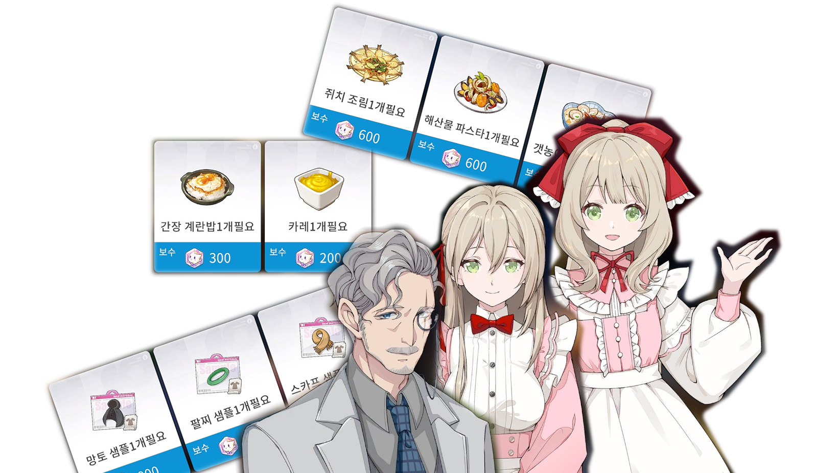

  

# Overfield_AutoShopGather

Overfield Daily Shop Info Auto Gatherer

Works watch action on every 23:55(KST), via cron-job.

## Headless account refresh

The workflow exchanges the saved launcher `OF_AUTH_TOKEN` for a fresh
`OF_LOGIN_TOKEN` before connecting to the game server. The rotated auth token is
written back to Repository Secrets, so later runs do not require a local PC.

One-time bootstrap:

1. Log in through the official launcher once.
2. Fill `GITHUB_SECRETS_PAT` in the local `.overfield-live.env`. The fine-grained
   PAT needs repository Actions secrets read/write access.
3. Set `GITHUB_SYNC_SECRETS=1`.
4. Run `refresh_live_env.bat`.
5. Confirm that Repository Secrets contain `OF_AUTH_TOKEN`, `OF_EMAIL`,
   `OF_ACCOUNT_LOGIN_URL`, and `AUTH_REFRESH_PAT`.
6. Run the `Daily Refresh` workflow manually once.

After bootstrap, each workflow run refreshes and persists its own account token.

## File saved on..
- original is [here](https://raw.githubusercontent.com/Vrcticfox/Overfield_AutoShopGather/refs/heads/main/AutoShopGather/output/live_daily_jobs.json)
- secondary is [here](https://raw.githubusercontent.com/Vrcticfox/ExternalResources/refs/heads/main/overfield/gatheredDaily/live_daily_jobs.json)

## Included Repos
- [of-ps](https://github.com/byzp/of-ps) (`AGPL-3.0`)
